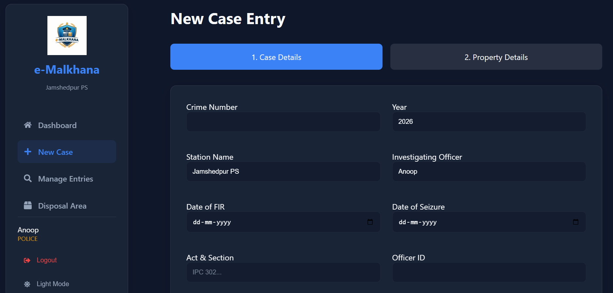
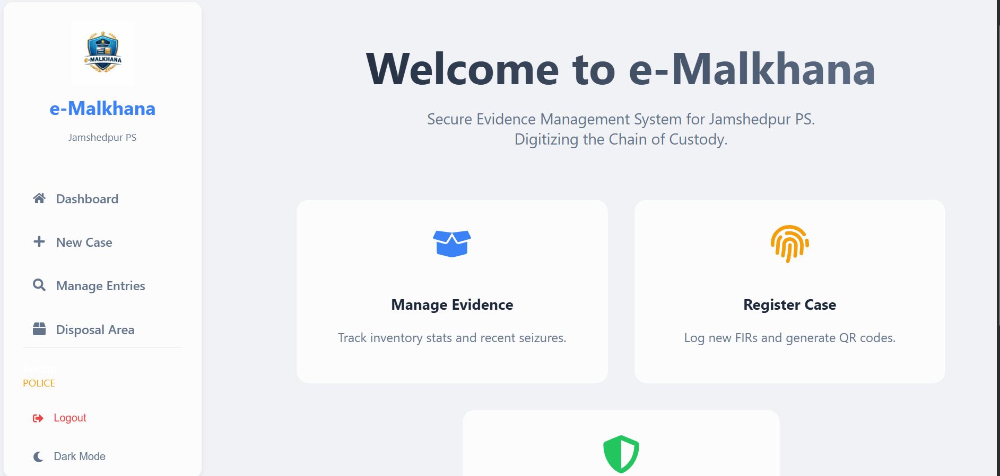

# Web Team Induction Hackathon Project

## This system models real evidence lifecycle — from seizure to disposal — while maintaining chain of custody logs and state transitions. I designed separate collections for cases, properties, custody logs, and disposal records to maintain data integrity.

# Digital e-Malkhana 🚓📦

**Digital e-Malkhana** is a MERN-stack web application designed to digitize the management of seized evidence (Malkhana) for police stations. It simulates the real-world lifecycle of evidence from seizure to disposal, ensuring a secure and transparent Chain of Custody.

## 🚀 Key Features

### 1. 🔐 Role-Based Access Control (RBAC)
*   **Admin**: Hardcoded secure access. Can register new Officers.
*   **Officer**: Created by Admin. Can manage cases, evidence, and custody.
*   **User (View-Only)**: Restricted access to search and view case status.

### 2. 📊 Interactive Dashboard
*   Real-time statistics: **Total Cases**, **Pending**, and **Disposed**.
*   View recent case activity at a glance.
*   **Printable Reports**: Generate formal PDF reports for the dashboard and specific cases.

### 3. 📝 Smart Case Entry
*   **Multi-step Wizard**: Streamlined process to register FIR details and Property info.
*   **Cloud Storage**: Evidence images uploaded securely to **Cloudinary**.
*   **Auto-QR Generation**: Generates a unique QR code for every seized item. Print QR capability included.

### 4. 🔗 Chain of Custody (Track & Trace)
*   **Visual Timeline**: A clear vertical timeline showing every movement of the evidence.
*   **Custody Updates**: Officers can log transfers with remarks and locations.

### 5. 🗑️ Disposal Management
*   Structured process to dispose of evidence (Returned, Destroyed, Auctioned).
*   Automatically closes the case and updates inventory.

### 6. 🎨 Premium UI/UX
*   **Fully Responsive**: optimized for Desktop, Tablet, and Mobile screens.
*   **Dark/Light Mode**: Toggle between themes with persisted user preference.
*   **Modern Aesthetics**: Glassmorphism design with smooth animations.

---

## 🛠️ Tech Stack

*   **Frontend**: React.js (Vite), React Router, Vanilla CSS (Glassmorphism UI).
*   **Backend**: Node.js, Express.js.
*   **Database**: MongoDB (Mongoose).
*   **Utilities**: 
    *   **Cloudinary**: Image storage.
    *   **QRCode**: QR code generation.
    *   **JWT**: Secure authentication.

---

## ⚙️ Setup & Installation

### Prerequisites
*   Node.js installed.
*   MongoDB installed and running locally (or a MongoDB Atlas URI).
*   Cloudinary Account (Cloud Name, API Key, API Secret).

### 1. Clone the Repository
```bash
git clone <repository-url>
cd "Web team Project"
```

### 2. Backend Setup
```bash
cd backend
npm install
```
*   Create a `.env` file in the `backend` folder:
    ```env
    PORT=5000
    MONGO_URI=your_mongodb_uri
    JWT_SECRET=your_jwt_secret
    
    # Cloudinary Config (for images)
    CLOUDINARY_CLOUD_NAME=your_cloud_name
    CLOUDINARY_API_KEY=your_api_key
    CLOUDINARY_API_SECRET=your_api_secret

    # Admin Credentials (for initial login)
    ADMIN_USERNAME=admin
    ADMIN_PASSWORD=admin123
    ```
*   Run the server:
    ```bash
    npm run dev
    ```

### 3. Frontend Setup
```bash
cd frontend
npm install
npm run dev
```

### 4. Running the App
1.  **Admin Login**: Use the credentials defined in `.env` (`ADMIN_USERNAME` / `ADMIN_PASSWORD`) to log in.
2.  **Register Officers**: Go to the **"Add Officer"** page (Sidebar) to create new accounts for police personnel.
3.  **Officer Workflow**: Log out and log in as the newly created Officer to start managing cases.
4.  **Case Management**:
    *   **New Case**: Add FIR details + Upload Property Image -> Generate QR.
    *   **Manage Entries**: View status, Print QR, or "Move" property (Chain of Custody).
    *   **Disposal**: Mark items as Disposed to close the loop.

---

## 📸 Screenshots
*(Add screenshots of your Dashboard, Case Entry, and Timeline here)*



---

**Built for NIT Jamshedpur Web Team Induction Hackathon**